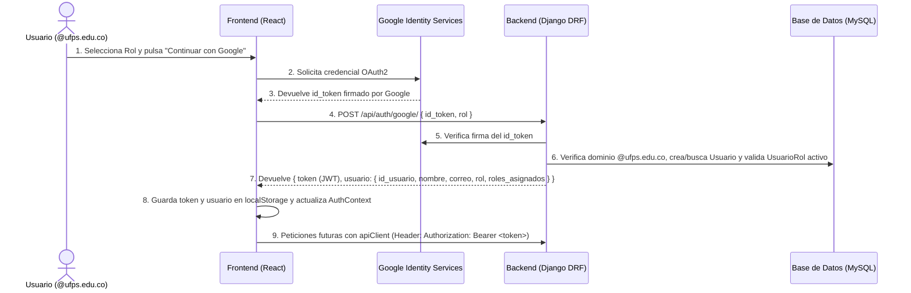

# Guía General de Arquitectura y Desarrollo para el Equipo — GENNOVA (IdeaCampus)

Esta guía está pensada para que todos los integrantes del equipo puedan comprender rápidamente cómo está construido el proyecto hoy, qué herramientas reutilizar y cómo desarrollar nuevas **Historias de Usuario (HU)** sin chocar con el trabajo de otros compañeros ni romper lo que ya funciona.

---

## 1. Estado General Actual del Proyecto

El proyecto **GENNOVA** se desarrolla sobre la rama **`develop`** (nuestra rama principal de integración) y actualmente cuenta con:

1. **Entorno Dockerizado listo (`docker-compose.yml`)**:
   * **Backend (`ideacampus_backend`)**: Django + Django REST Framework corriendo en `http://localhost:8000`.
   * **Frontend (`ideacampus_frontend`)**: React 19 + Vite 8 corriendo en `http://localhost:5173`.
   * **Base de Datos MySQL**: Conectada en desarrollo a una instancia compartida en Railway (o configurable en local en el puerto `3306`).
2. **Módulo de Gestión Administrativa y Autenticación (`HU-01`) completado**:
   * Inicio de sesión con **Google Workspace UFPS (`@ufps.edu.co`)**.
   * Validación de roles asignados en base de datos (`estudiante`, `admin`, `direccion_del_programa`, `coordinador`, `tutor`, `mentor`, `evaluador`).
   * Emisión y verificación de **Tokens JWT** con expiración de 24 horas.
   * Clases reutilizables de permisos por rol en el Backend (`permissions.py`).
   * Cliente HTTP centralizado (`apiClient.js`) y contexto global de sesión (`AuthContext.jsx`) en el Frontend.
3. **Suite de Pruebas Automatizadas**:
   * Configurada para ejecutarse en memoria (SQLite `:memory:`) al correr `python manage.py test`, sin alterar ni borrar datos de la base de datos compartida de Railway.

---

## 2. Estructura del Proyecto y Responsabilidades

```text
ideacampus/
├── .env.example                  # Plantilla de variables de entorno (copiar a .env)
├── docker-compose.yml            # Orquestación de contenedores (backend, frontend, db)
├── README.md                     # Instrucciones de instalación inicial
├── docs/                         # Documentación, diagramas, matrices y esta guía
│   └── GUIA_DESARROLLO_EQUIPO.md
├── backend/                      # API REST en Python 3.12 / Django
│   ├── manage.py
│   ├── requirements.txt          # Librerías de Python
│   ├── core/                     # Configuración global del proyecto Django
│   │   ├── settings.py           # Configuración de BD, CORS, JWT y Apps instaladas
│   │   └── urls.py               # Enrutador raíz (conecta los urls.py de cada módulo)
│   └── gestion_administrativa/   # App transversal: Usuarios, Roles, Permisos, Auth y Parámetros
│       ├── models.py             # Tablas: usuario, rol, usuario_rol, permiso, rol_permiso, variable_caracterizacion
│       ├── authentication.py     # Autenticación DRF por token JWT (JWTAuthentication)
│       ├── permissions.py        # Clases de autorización por rol (EsAdmin, TieneRolPermitido, etc.)
│       ├── jwt_utils.py          # Creación y verificación de tokens JWT
│       ├── views.py              # Endpoints: /api/auth/google/ y /api/auth/me/
│       ├── urls.py               # Rutas propias del módulo
│       └── tests.py              # Pruebas unitarias del módulo
└── frontend/                     # Aplicación SPA en React 19 + Vite 8
    ├── package.json
    └── src/
        ├── main.jsx              # Punto de entrada de React
        ├── App.jsx               # Componente raíz envuelto en <AuthProvider>
        ├── context/
        │   └── AuthContext.jsx   # Estado global de sesión (useAuth)
        ├── services/
        │   └── apiClient.js      # Cliente HTTP que adjunta el JWT automáticamente
        └── modules/              # Carpetas organizadas por módulo del sistema
            └── gestion_administrativa/
                ├── components/   # Componentes reutilizables del módulo
                ├── pages/        # Vistas completas (LoginPage, SuccessPage, etc.)
                └── services/     # Llamadas a la API propias del módulo (authService.js)
```

---

## 3. Cómo Funciona el Flujo General y la Autenticación



### Reglas clave de la autenticación actual:
1. **Solo correos `@ufps.edu.co`**: El backend rechaza con `403 Forbidden` cualquier cuenta que no termine en `@ufps.edu.co`.
2. **Asignación automática de rol `estudiante`**: Todo usuario institucional que inicia sesión por primera vez queda registrado en la tabla `usuario` y recibe automáticamente el rol `estudiante` activo en `usuario_rol`.
3. **Validación de roles especiales**: Para ingresar como `admin`, `direccion_del_programa`, `coordinador`, `tutor`, `mentor` o `evaluador`, el usuario debe tener ese rol asignado y con `estado = "activo"` en la tabla `usuario_rol`.

---

## 4. Cómo Reutilizar lo que ya Existe (Backend y Frontend)

### A. En el Backend (Django REST Framework)

#### 1. Cómo proteger un endpoint y exigir uno o varios roles
Gracias a que `JWTAuthentication` ya está configurado por defecto en `settings.py`, **no necesitas volver a decodificar tokens manualmente**. Solo importa las clases de `gestion_administrativa.permissions`:

```python
from rest_framework.views import APIView
from rest_framework.response import Response
from gestion_administrativa.permissions import TieneRolPermitido, EsAdmin

# Ejemplo 1: Permitir acceso solo al rol 'admin'
class ConfigurarParametrosView(APIView):
    permission_classes = [EsAdmin]

    def get(self, request):
        # request.user es la instancia del modelo Usuario de nuestra BD
        # request.user.rol_activo contiene el rol con el que inició sesión
        return Response({"usuario": request.user.correo, "rol": request.user.rol_activo})

# Ejemplo 2: Permitir acceso a varios roles (ej. 'admin' y 'coordinador')
class CrearConvocatoriaView(APIView):
    permission_classes = [TieneRolPermitido]
    roles_permitidos = ["admin", "coordinador"]

    def post(self, request):
        ...
```

Clases de permisos listas para importar desde `gestion_administrativa.permissions`:
* `TieneRolPermitido` (definiendo `roles_permitidos = [...]` en la vista o `ViewSet`)
* `EsAdmin` (`admin`)
* `EsDireccionPrograma` (`direccion_del_programa`)
* `EsCoordinador` (`coordinador`)
* `EsTutor` (`tutor`)
* `EsMentor` (`mentor`)
* `EsEvaluador` (`evaluador`)
* `EsEstudiante` (`estudiante`)

#### 2. ⚠️ ¡No dupliques los modelos de Usuarios o Roles!
Los modelos `Usuario`, `Rol`, `UsuarioRol`, `Permiso`, `RolPermiso` y `VariableCaracterizacion` **ya existen** en `backend/gestion_administrativa/models.py`.
Si tu módulo (por ejemplo, `gestion_convocatorias` o `expediente_digital`) necesita relacionarse con un `Usuario`, impórtalo directamente:

```python
from gestion_administrativa.models import Usuario
```
**Nunca crees una nueva app `usuarios` ni vuelvas a declarar `db_table = 'usuario'`**, ya que chocará con las tablas existentes en MySQL.

---

### B. En el Frontend (React)

#### 1. Cómo hacer peticiones al Backend (`apiClient`)
Usa siempre `apiClient` (`frontend/src/services/apiClient.js`). Este cliente toma automáticamente la URL base (`VITE_API_URL`), adjunta el header `Authorization: Bearer <token>` y lanza un `Error` claro si el servidor devuelve `400`, `401` o `403`:

```javascript
import { apiClient } from "../../../services/apiClient";

// GET http://localhost:8000/api/convocatorias/
export function listarConvocatorias() {
  return apiClient.get("/convocatorias/");
}

// POST http://localhost:8000/api/convocatorias/
export function crearConvocatoria(datos) {
  return apiClient.post("/convocatorias/", datos);
}
```

#### 2. Cómo leer los datos del usuario logueado, su rol o cerrar sesión (`useAuth`)
En cualquier componente o Layout (como `MainLayout.jsx`), importa el hook `useAuth`:

```jsx
import { useAuth } from "../../../context/AuthContext";

function MiComponente() {
  const { usuario, rolActivo, rolesAsignados, hasRole, logout } = useAuth();

  return (
    <header>
      <span>Hola, {usuario?.nombre} ({rolActivo})</span>
      {hasRole(["admin", "coordinador"]) && (
        <button type="button">Nueva Convocatoria</button>
      )}
      <button type="button" onClick={logout}>Cerrar sesión</button>
    </header>
  );
}
```

---

## 5. Paso a Paso: Cómo Implementar una Nueva Historia de Usuario

### Dónde debe ir cada cambio:
| Tipo de cambio | Ubicación exacta |
| :--- | :--- |
| Nueva funcionalidad de un módulo existente en Backend | Dentro de `backend/<nombre_modulo>/` (`models.py`, `serializers.py`, `views.py`, `urls.py`, `tests.py`) |
| Nuevo módulo de Backend (ej. Convocatorias) | Crear app `backend/gestion_convocatorias/`, registrarla en `INSTALLED_APPS` de `core/settings.py` y conectar su `urls.py` en `core/urls.py` con `path('api/', include('...'))` |
| Nuevas pantallas o componentes de Frontend | Dentro de `frontend/src/modules/<nombre_modulo>/` (`pages/`, `components/`, `services/`) |
| Utilidades o componentes compartidos por todo el Frontend | `frontend/src/components/`, `frontend/src/services/` o `frontend/src/context/` |

### Reglas para no romper lo que ya funciona:
1. **No agregues vistas directamente en `backend/core/urls.py`**: Crea o usa el archivo `urls.py` dentro de tu app de Django e inclúyelo en `core/urls.py` con `include()`. Así evitamos conflictos de `merge`.
2. **Nunca subas el archivo `.env` ni escribas contraseñas reales en `.env.example`**.
3. **Si creas o modificas modelos en Django**, genera la migración dentro del contenedor:
   ```powershell
   docker compose exec backend python manage.py makemigrations
   docker compose exec backend python manage.py migrate
   ```

---

## 6. Cómo Probar tu Funcionalidad Antes de Subirla (Checklist de Calidad)

Antes de abrir un Pull Request, ejecuta siempre estos 3 comandos desde la raíz del repositorio (`ideacampus/`) con los contenedores encendidos:

1. **Ejecutar las pruebas unitarias del Backend** (corren en memoria sin afectar Railway):
   ```powershell
   docker compose exec backend python manage.py test
   ```
2. **Verificar que el Frontend no tenga errores de Linter (`oxlint`)**:
   ```powershell
   docker compose exec frontend npm run lint
   ```
3. **Verificar que el Frontend compile para producción (`vite build`)**:
   ```powershell
   docker compose exec frontend npm run build
   ```

---

## 7. Flujo de Trabajo con Git (Ramas, Commits y Pull Requests)

### 1. Siempre partir desde `develop` actualizado (¡NUNCA desde `main`!)
Antes de empezar una historia de usuario:
```powershell
git checkout develop
git pull origin develop
git checkout -b feat/HU-XX-descripcion-corta
```
*Prefijos de ramas usados en el proyecto*:
* `feat/HU-XX-...` para historias de usuario nuevas.
* `fix/...` para corrección de errores.
* `chore/...` o `refactor/...` para configuración o mejoras internas.

### 2. Convención de Commits (Conventional Commits)
Cada commit debe ser pequeño, claro y usar uno de los siguientes prefijos indicando entre paréntesis el módulo afectado:
* `feat(modulo):` Nueva funcionalidad. *Ej: `feat(convocatorias): implementar cierre automatico por fecha`*
* `fix(modulo):` Corrección de errores. *Ej: `fix(auth): validar dominio institucional @ufps.edu.co`*
* `docs(modulo):` Cambios en documentación. *Ej: `docs(guia): agregar guia de desarrollo para el equipo`*
* `chore(modulo):` Configuración o mantenimiento. *Ej: `chore(docker): agregar variable VITE_API_URL`*
* `refactor(modulo):` Mejora de código sin cambiar funcionalidad. *Ej: `refactor(auth): extraer cliente HTTP centralizado`*

### 3. Pull Requests (PR) hacia `develop`
* Todo Pull Request debe apuntar a la rama **`develop`** (no a `main`).
* Completa la plantilla automática del PR (`.github/pull_request_template.md`) vinculando el Issue (`Closes #XX`) y marcando las pruebas realizadas.

---

## 8. Consideraciones Importantes sobre las Ramas Actuales del Equipo

Al revisar las ramas remotas activas en el repositorio, ten en cuenta lo siguiente antes de integrarlas en `develop`:

1. **Rama `origin/feat/HU-02-backend`**:
   * Fue creada a partir de un commit antiguo previo a `gestion_administrativa` e incluye una carpeta `backend/usuarios/` cuyos modelos (`Usuario`, `Rol`, `UsuarioRol`, etc.) **ya existen en `backend/gestion_administrativa/models.py` en `develop`**.
   * Antes de hacer merge de `feat/HU-02-backend` a `develop`, se debe actualizar con `develop`, eliminar la app duplicada `backend/usuarios/` y conservar únicamente la app `backend/gestion_convocatorias/`.
2. **Rama `origin/feat/HU-18-frontend-panel-administrador`**:
   * En su `frontend/package.json` tiene instalados tanto `"tailwind": "^4.0.0"` como `"tailwindcss": "^3.4.17"`. Se recomienda dejar únicamente `"tailwindcss": "^3.4.17"`.
   * Su componente `MainLayout.jsx` tiene un estado `userSession` simulado (`"Obed Ayala"`). Al integrarlo con `develop`, ya puede conectarse directamente al hook **`useAuth()`** de `src/context/AuthContext.jsx` para mostrar el nombre real, correo, `rolActivo`, `rolesAsignados` y el botón `logout` reales.
